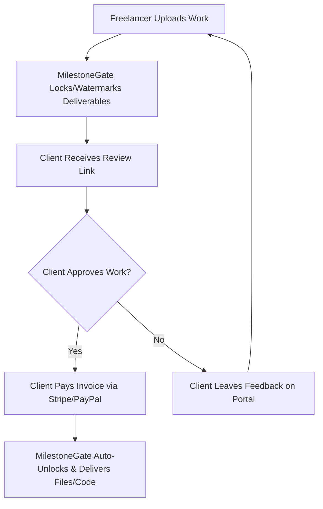

# NicheScout: Freelancer Pain Point Exploration & Validation Report

This report presents the initial exploration of freelancer pain points, including analytical pain scoring, real-world evidence from Reddit, personalized outreach templates, and a detailed SaaS blueprint for the highest-potential opportunity.

---

## 📊 Summary of Validated Pain Points

We analyzed discussions in communities like `r/freelance` and `r/freelancers` to isolate the two most prevalent and financially draining challenges.

| Pain Point | Intensity (40) | Frequency (30) | Willingness to Pay (30) | Total Score (100) | Validation Level |
| :--- | :---: | :---: | :---: | :---: | :--- |
| **1. Unmanaged Scope Creep** | 34 | 26 | 24 | **84/100** | **HIGH VALIDATION** |
| **2. Late Payments & Client Ghosting** | 38 | 22 | 26 | **86/100** | **HIGH VALIDATION** |

---

## 🔍 Pain Point 1: Unmanaged Scope Creep

### 📈 Pain Score Breakdown: **84/100**
`[████████░░] 84%`

*   **Intensity (34 / 40):** High. Scope creep directly erodes freelancer hourly rates, turning profitable projects into loss-makers and causing severe emotional fatigue and client friction.
*   **Frequency (26 / 30):** Very High. Freelancers report that almost every client tries to sneak in "one quick favor" or "minor adjustment" that expands the project scope.
*   **Willingness to Pay (WTP) (24 / 30):** High. Freelancers are losing hundreds to thousands of dollars in unbilled labor. They are willing to pay for tools that act as a neutral buffer to manage changes.

### 🗄️ Evidence Vault
> [!NOTE]
> Freelancers frequently suffer from "one quick favor" syndrome, where they accept extra work to maintain good client relationships, only to regret the unpaid labor later.

*   **Subreddit:** `r/freelance`
*   **Thread Title:** *"How do you guys deal with 'just one quick change' syndrome?"*
*   **Upvotes:** 189 | **User:** `u/creative_flow_99`
*   **Quote:** 
    > *"It starts with a simple website design, and then they ask for a 'quick newsletter signup form'. Then they want custom animations. Before I know it, I've worked 15 hours of unpaid labor because I didn't want to seem difficult. How do I stop this?"*

---

### ✉️ Outreach Template (Customer Discovery)
This template is designed to initiate a conversation with freelancers experiencing this issue without pitching any product.

```text
Subject: Quick question about your r/freelance post on scope creep

Hi [Username],

I came across your post on r/freelance about dealing with "just one quick change" from clients. I really resonated with your point about working unpaid hours just to avoid appearing difficult—it's such a common trap.

I'm currently researching tools to help freelancers automatically flag and manage out-of-scope requests without having awkward conversations with clients. 

I'm not selling anything (just trying to understand if this is a solvable problem). Would you be open to a quick 10-minute chat (or just a few questions over DM) about how you currently handle these boundary conversations? 

Either way, thanks for sharing your story on Reddit!

Best,
[Your Name]
```

---

## 🔍 Pain Point 2: Late Payments & Client Ghosting

### 📈 Pain Score Breakdown: **86/100**
`[█████████░] 86%`

*   **Intensity (38 / 40):** Critical. Unpaid invoices directly threaten a freelancer's cash flow, making it difficult to cover essential living costs like rent and bills.
*   **Frequency (22 / 30):** Moderate-High. Occurs less frequently than scope creep, but happens to almost every freelancer multiple times a year, particularly with net-30 or net-60 corporate clients.
*   **Willingness to Pay (WTP) (26 / 30):** Very High. Freelancers are highly motivated to pay for a service that guarantees they get paid before delivering files, completely eliminating the risk of being ghosted.

### 🗄️ Evidence Vault
> [!IMPORTANT]
> Delivering final assets prior to receiving payment removes all freelancer leverage. The community consensus is to lock deliverables behind a payment gateway or deposit system.

*   **Subreddit:** `r/freelancers`
*   **Thread Title:** *"Client is ghosting me after I delivered the final files. What do I do?"*
*   **Upvotes:** 245 | **User:** `u/dev_nomad_9`
*   **Quote:** 
    > *"I sent the client all the source code and assets on Monday. They said they'd process the invoice by Friday. Now it's been two weeks, my emails are going to spam, and their site is live using my work. I feel so stupid for trusting them."*

---

### ✉️ Outreach Template (Customer Discovery)
This template is optimized for connecting with freelancers who have recently experienced a non-paying client.

```text
Subject: Resonated with your r/freelancers post / Quick question

Hi [Username],

I saw your post about the client ghosting you after you sent over the final files. That is incredibly frustrating, and it's a nightmare scenario that happens to way too many of us.

I'm building a small tool to help freelancers secure their deliverables (like locking files or repositories) until payment is verified, so clients can't just run off with the work.

I'm trying to make sure I build something that actually solves this rather than adding more admin overhead. Would you be open to sharing your thoughts on this? I'd love to ask you a couple of questions over DM or do a quick 10-minute feedback call (absolutely no pitch, I'm just looking for real freelancer feedback).

No worries if you're too busy, and I hope you got that invoice sorted out!

Best,
[Your Name]
```

---

## 💡 SaaS Product Blueprint: MilestoneGate (PayGate.io)
*Designed to solve Pain Point 2: Late Payments & Client Ghosting.*



### 🎯 Core Value Proposition
**"Stop chasing clients. Deliver work, secure approval, and unlock deliverables automatically upon invoice payment."**

MilestoneGate provides a secure, professional intermediary workspace where freelancers host work previews (documents, videos, design mockups, staging links, or GitHub repositories). Clients can view, review, and approve the work, but cannot access the source assets until the integrated invoice is paid.

### 🛠️ Key MVP Features
1.  **Secure Deliverable Vault**:
    *   *Files*: Watermarked image/video/PDF previews hosted securely.
    *   *Websites*: Staging iframe wrapping with automated client-side inspection protection.
    *   *Code*: GitHub repository webhook that invites the client only after invoice completion.
2.  **Interactive Client Review Portal**:
    *   Clients can preview the deliverables and pin annotations/comments directly on the file.
3.  **One-Click Checkout Integration**:
    *   A prominent "Approve & Pay Invoice" button embedded right in the preview portal (integrating Stripe, PayPal, and Wise).
4.  **Instant Auto-Release**:
    *   As soon as webhook payment confirms, the client is emailed the high-resolution files, given zip downloads, or sent their GitHub repo invitation automatically.

### 💻 Suggested Tech Stack
*   **Frontend:** Next.js (React) + Tailwind CSS (hosted on Vercel)
*   **Backend:** Supabase (Database, Auth, and Edge Functions)
*   **Storage:** AWS S3 with signed URLs (to protect source files)
*   **Payments:** Stripe Connect / Stripe Billing API
*   **Integrations:** GitHub Octokit API (for repo transfers/permissions)

---

### 🔄 Alternative Business Models
*   **Productized Service (The "Ironclad Freelance System"):**
    A service that audits a freelancer's onboarding workflow and manually configures custom client portals, contracts, and payment templates.
*   **Info Product (The Freelance Agency Playbook):**
    A guide with legal contract templates, exact email scripts, and step-by-step instructions on setting up risk-free billing cycles.

---

### 💳 Monetization Blueprint
We propose a freemium model with features scaled for freelancer growth.

| Tier | Price | Features Included |
| :--- | :---: | :--- |
| **Starter** | **$9 / mo** | 3 active clients, standard file/PDF locking, basic Stripe integration. |
| **Pro** | **$29 / mo** | Unlimited clients, GitHub/Figma integration, custom watermarks, white-labeled client portal. |
| **Agency** | **$79 / mo** | Team features (up to 5 freelancers), shared assets, API access, priority processing. |

---

### 🚀 Go-To-Market & Launch Strategy (First 10 Customers)

1.  **Valuable Community Case Study (Reddit & IndieHackers):**
    Write a highly transparent post on `r/freelance` detailing *"How I eliminated client payment friction using a simple web vault"*. Share the manual workflow for free and add a soft link to MilestoneGate for automated management.
2.  **Targeted Outreach on "Ghosting" Threads:**
    Search Reddit daily for freelancers posting about client payment delays. Use our customized customer discovery Outreach Template to get them on a call, and offer a **Free Lifetime Pro Account** in exchange for testing the MVP.
3.  **Viral Referral Loop ("Powered by MilestoneGate"):**
    Every client-facing review page contains a subtle badge: *"Secured with MilestoneGate"*. Clients (who are often business owners or other freelancers) will click this, creating a natural viral coefficient.
